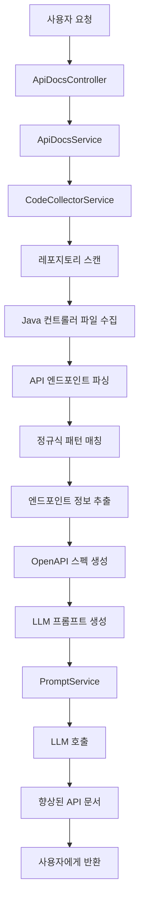
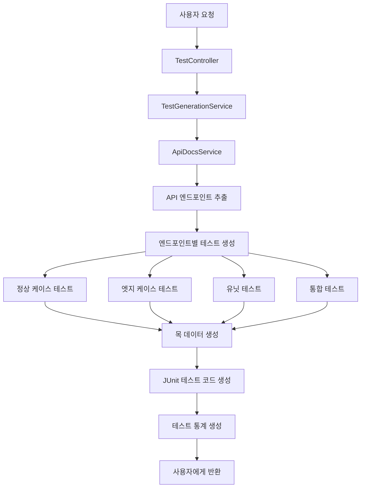
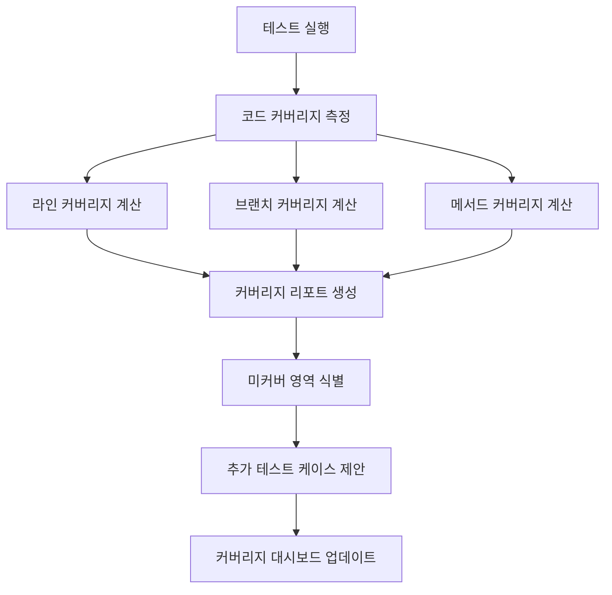
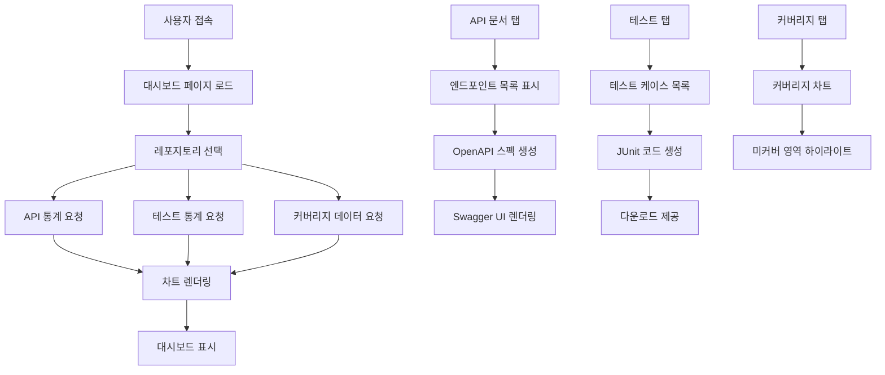
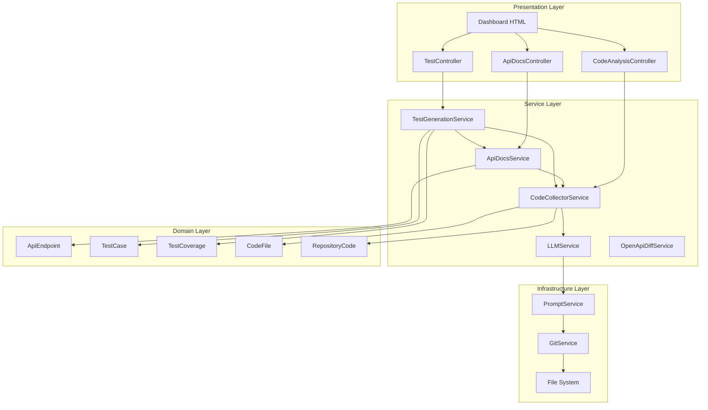
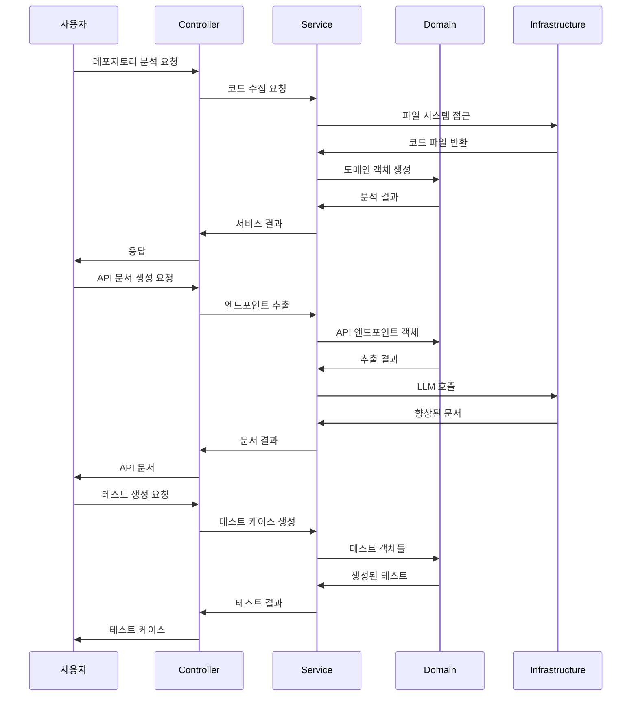

# MCP Docs Server - 전체 동작 흐름

## 1. 코드 기반 API 문서 작성 흐름

## 2. 코드 기반 테스트 생성 흐름

## 3. 테스트 커버리지 분석 흐름

## 4. 프론트엔드 대시보드 흐름

## 5. 전체 시스템 아키텍처

## 6. 데이터 흐름

## 7. 주요 기능별 상세 흐름

### 7.1 API 엔드포인트 추출

1. **파일 스캔**: Java 컨트롤러 파일 식별
2. **정규식 파싱**: `@GetMapping`, `@PostMapping` 등 어노테이션 추출
3. **메타데이터 수집**: 경로, 메서드, 파라미터, 설명 등
4. **OpenAPI 변환**: 표준 OpenAPI 3.0 스펙으로 변환

### 7.2 테스트 케이스 생성

1. **엔드포인트 분석**: 각 API의 특성 파악
2. **테스트 타입 결정**: UNIT, INTEGRATION, E2E, EDGE
3. **목 데이터 생성**: 테스트 타입별 적절한 데이터
4. **JUnit 코드 생성**: 실행 가능한 테스트 코드

### 7.3 커버리지 분석

1. **테스트 실행**: 생성된 테스트 실행
2. **커버리지 측정**: 라인, 브랜치, 메서드 커버리지
3. **미커버 영역 식별**: 테스트되지 않은 코드 부분
4. **추가 테스트 제안**: 커버리지 향상을 위한 테스트 케이스

### 7.4 프론트엔드 대시보드

1. **데이터 수집**: API, 테스트, 커버리지 통계
2. **차트 렌더링**: Chart.js를 사용한 시각화
3. **인터랙티브 기능**: 실시간 데이터 업데이트
4. **다운로드 기능**: 생성된 문서/코드 다운로드
